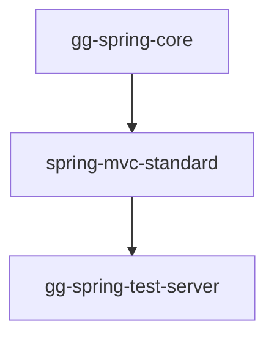

# GameGureumi

This project was initiated as a personal study project and is currently underway to explore and develop a general game server infrastructure.

### Contents
- [Overview](#overview)
- [Directory Structure](#directory-structure)
- [Dependency Graph (current)](#dependency-graph-current)

### Overview
- This project is started to create a general game server infrastructure.
- This project uses bazel to build and manage the project.
```sh
# You can run the test server using the following command.
bazel run //sources/applications/spring-test-server:gg-spring-test-server
```

### Directory Structure
```
.
|-- docs
|-- documents
|   `-- conventions
|	   |-- api
|	   |-- common
|	   |-- git
|	   |-- java
|	   |-- javascript
|	   `-- vault
|-- launchers
|-- sources
|   |-- applications
|   |-- libraries
|   `-- utilities
`-- tools
```

### Dependency Graph (current)

