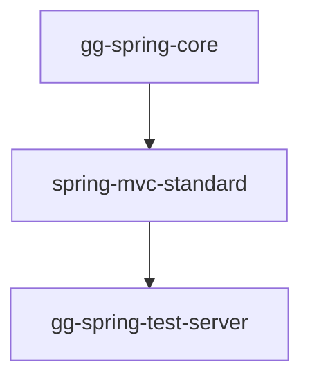

# Architecture

## List of Contents
- [Dependency Graph (current)](#dependency-graph-current)

## Dependency Graph (current)

```mermaid
graph TD
    gg-spring-core["gg-spring-core"]
    gg-spring-mvc-standard["spring-mvc-standard"]
    gg-spring-test-server["gg-spring-test-server"]

    gg-spring-core --> gg-spring-mvc-standard
    gg-spring-mvc-standard --> gg-spring-test-server
```